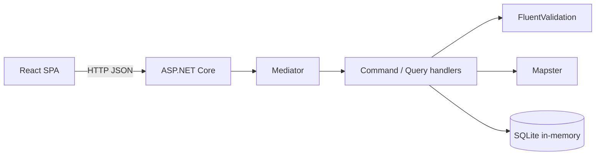

# Лабораторная работа № 1

**Дисциплина:** методы и технологии проектирования сложных систем (MTPSA)  
**Тема:** информационная система банка, модуль «Клиенты»  
**Вариант:** 1  
**Исполнитель:** Глушаченко Никита Сергеевич  
**Репозиторий:** _ссылка будет добавлена_

## 1. Цель работы

Реализовать модуль учёта клиентов банка с формой ввода/редактирования, списком клиентов, REST API, двойной валидацией (клиент и сервер) и набором автотестов: модульных, интеграционных и функциональных.

## 2. Постановка задачи

По заданию лабораторной работы необходимо:

1. Реализовать карточку клиента с полями варианта.
2. Вынести списковые значения в отдельные справочники.
3. Хранить данные в БД (в задании — H2; в работе — in-memory SQLite).
4. Поддержать добавление, редактирование и удаление клиента.
5. Вывести список клиентов, отсортированный по фамилии.
6. Реализовать REST-сервис.
7. Реализовать web-клиент с формой списка и формой карточки.
8. Проверять данные и на клиенте, и на сервере.
9. Заполнить БД не менее чем пятью клиентами, включая данные студента.

Стек задания (Java + Spring + H2) заменён на **C# / ASP.NET Core + React + in-memory SQLite**. Функциональные требования сохранены.

### 2.1. Вариант 1

В карточку входят все поля группы «любой», плюс поля нечётного варианта и поля с условием `N % 3 == 1`.

**Есть:** фамилия, имя, отчество, дата рождения, паспорт (серия, номер, кем выдан, дата выдачи), идентификационный номер, место рождения, город и адрес фактического проживания, город прописки, телефоны, e-mail, место работы и должность, семейное положение, гражданство, инвалидность, пенсионер, ежемесячный доход.

**Нет:** пол (чётное), улица прописки (`N % 3 == 2`), военнообязанный (`N % 3 == 0`).

Город прописки обязателен. Место работы и должность необязательны.

Маски — по правилам РБ: серия паспорта (2 латинские буквы), номер (7 цифр), идентификационный номер, домашние и мобильные телефоны `+375`, e-mail.

## 3. Архитектура решения

Приложение состоит из трёх частей:

- `Bank.Clients` — ASP.NET Core API и раздача собранного SPA;
- `frontend` — React (Vite): список клиентов и форма карточки;
- `Bank.AppHost` — .NET Aspire, совместный запуск API и Vite.

База — SQLite в режиме `Mode=Memory;Cache=Shared`. При старте выполняется `Migrate()` и заполняются справочники и шесть клиентов-сидов, первый — Глушаченко Никита Сергеевич.



Обработка запроса:

1. Endpoint принимает HTTP и отправляет сообщение в Mediator: `mediator.Send(...)`.
2. Mediator по типу Command/Query находит handler (source generator, без ручной регистрации каждой пары).
3. Handler валидирует вход, работает с EF Core и маппит сущности в DTO.
4. Результат (`FluentResults`) переводится в HTTP: 200/201/204, 400 с ошибками полей, 404.

Command меняет данные, Query только читает. Вход create/update — `ClientRequest` (строки дат, нормализация). Ответы — отдельные DTO: `ClientResponse`, `ClientListItem`, `LookupItem`. Сущности БД наружу не отдаются.

Справочные имена локализуются по `Accept-Language` (`NameEn` / `NameRu`). Тексты ошибок API — ключи i18n; перевод на EN/RU делает клиент.

## 4. Реализация

### 4.1. Модель данных

Таблицы: `Clients`, `Cities`, `MaritalStatuses`, `Citizenships`, `Disabilities`.

Уникальность клиента:

- ФИО + дата рождения;
- серия + номер паспорта;
- идентификационный номер.

Связи со справочниками — внешние ключи с `Restrict` при удалении.

### 4.2. REST API

| Метод | URL | Назначение |
| --- | --- | --- |
| `GET` | `/api/dictionaries` | Справочники |
| `GET` | `/api/clients` | Список, сортировка по ФИО |
| `GET` | `/api/clients/{id}` | Карточка |
| `POST` | `/api/clients` | Создание |
| `PUT` | `/api/clients/{id}` | Обновление |
| `DELETE` | `/api/clients/{id}` | Удаление |

### 4.3. Web-клиент

Маршруты:

- `/clients` — таблица, сортировка по фамилии, переход к созданию/редактированию, удаление;
- `/clients/new` и `/clients/:id/edit` — форма карточки.

На клиенте те же правила, что на сервере: обязательные поля, ФИО, даты `дд.мм.гггг` (в том числе отказ `31.02.2015` и `29.02.2015`), маски паспорта/идентификатора/телефонов/e-mail. Необязательные поля можно оставить пустыми. Ошибки сервера показываются у соответствующих полей. Интерфейс — английский, есть переключение EN/RU и светлая/тёмная тема.

### 4.4. Валидация

Сервер: FluentValidation + проверка существования справочников и уникальности (`ClientWriteValidator`).  
Клиент: `frontend/src/validation.ts` с теми же регулярными выражениями.

Примеры правил:

- фамилия/имя/отчество — только буквы (латиница, кириллица, `І/і/Ў/ў`);
- серия паспорта — `^[A-Za-z]{2}$`;
- номер паспорта — 7 цифр;
- идентификационный номер — `\d{7}[A-Za-z]\d{3}[A-Za-z]{2}\d`;
- домашний телефон — `+375 (xx) xxx-xx-xx`;
- мобильный — коды 29/33/44/25.

## 5. Тестирование

Тесты — MSTest, проект `Test.Clients`. Три уровня:

| Уровень | Что проверяет | Как |
| --- | --- | --- |
| Unit | валидатор, разбор дат, handlers | in-memory SQLite без HTTP |
| Integration | REST: уникальность, маски, обязательные поля, невалидные даты | реальный Kestrel + HTTP |
| Functional | те же сценарии в браузере | Selenium WebDriver, headless Chrome, собранный SPA |

Сценарии защиты (и на API, и в UI):

- повторное сохранение студента (ФИО + дата рождения) — отказ, в БД не появляется вторая запись;
- дубликат паспорта и идентификационного номера;
- фамилия `1234`;
- пустое имя;
- даты `not-a-date`, `31.02.2015`, `29.02.2015`;
- невалидные маски серии/номера паспорта, идентификатора, телефонов, e-mail;
- пропуск обязательного поля;
- успешное сохранение только обязательных полей.

Запуск:

```bash
dotnet test Test.Clients/Test.Clients.csproj
```

Прогон: **102** теста (71 unit/integration + 31 functional).

## 6. Запуск приложения

```bash
dotnet run --project Bank.AppHost
```

Либо отдельно API (`Bank.Clients`) и `npm run dev` в `frontend`. SPA после публикации отдаётся статикой из `wwwroot`.

## 7. Выводы

Реализован модуль «Клиенты» варианта 1: CRUD, справочники, in-memory SQLite, REST и React-формы. Валидация дублируется на клиенте и сервере. Уникальность ФИО+даты, паспорта и идентификационного номера защищает БД от повторной записи. Покрытие включает модульные тесты handlers, интеграционные тесты API и функциональные тесты UI на WebDriver.
