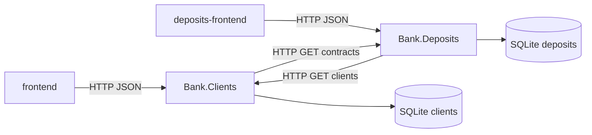

# Лабораторная работа № 2

**Дисциплина:** методы и технологии проектирования сложных систем (MTPSA)  
**Тема:** информационная система банка, модуль «Депозитные операции с физическими лицами»  
**Вариант:** ЗАО «Альфа-Банк» (Республика Беларусь)  
**Исполнитель:** Глушаченко Никита Сергеевич  
**Репозиторий:** _ссылка будет добавлена_

## 1. Цель работы

Реализовать модуль депозитных операций с физическими лицами: справочник плана счетов, заключение депозитного договора, открытие лицевых счетов, двойную запись по учебной схеме, процедуру «Закрытие банковского дня», оборотную ведомость, связь с модулем «Клиенты» (лабораторная работа № 1), REST API, web-клиент и набор автотестов: модульных, интеграционных и функциональных.

## 2. Постановка задачи

По заданию лабораторной работы необходимо:

1. Для банка варианта выбрать два депозитных продукта для физических лиц:
   - отзывный вклад до востребования с ежемесячной выплатой процентов;
   - срочный безотзывный вклад с выплатой процентов в конце срока.
2. Разработать справочник «План счетов» и внести в него счета, необходимые для обслуживания выбранных депозитных линий.
3. Разработать форму заключения депозитного договора с контролем корректности вводимых данных.
4. Связать данные о физическом лице с модулем «Клиенты». При заключении договора создавать не менее двух счетов (основная сумма и обслуживание процентов) с 13-значной нумерацией.
5. Предусмотреть счёт фонда развития банка (СФРБ) со стартовым капиталом 1 000 000 бел. рублей.
6. Реализовать процедуру «Закрытие банковского дня», изменяющую состояние счетов в соответствии с выбранными программами (выплата процентов без задержки), и отчёт по счетам (при активных программах — не менее шести счетов).

Стек задания (Java + Spring + H2) заменён на **C# / ASP.NET Core + React + in-memory SQLite**, как в лабораторной работе № 1. Функциональные требования сохранены.

### 2.1. Вариант: Альфа-Банк (Беларусь)

Классического вклада «до востребования» в действующем каталоге банка нет. Выбраны ближайшие продукты под формулировки задания ([каталог вкладов](https://www.alfabank.by/deposits/), сверка 20.09.2026):

| Требование задания | Продукт банка | Балансовый счёт | Ставка | Срок | Сумма | Выплата в системе |
| --- | --- | --- | --- | --- | --- | --- |
| Отзывный, проценты ежемесячно | [Альфа Сейф](https://www.alfabank.by/deposits/byn/alfa-safe/) | 3404 | 5,5% | 13 мес. | 200–20 000 BYN | каждые 30 дней |
| Срочный безотзывный | [Альфа Вклад](https://www.alfabank.by/deposits/byn/alfa-deposit/) | 3414 | 12% (линейка 13 мес.) | 13 мес. | 50–5 000 000 BYN | в конце срока |

Отступления от публичного тарифа, принятые для соответствия тексту задания:

- по «Альфа Сейф» не моделируется вторая ставка 3% на сумму сверх непрерывного остатка: проценты начисляются на тело вклада по 5,5%;
- по «Альфа Вклад» у банка выплата два раза в месяц; по заданию проценты выплачиваются только в конце срока;
- указанная на сайте ставка «до 13,6%» относится к сроку 37 месяцев, а не к выбранной линейке 13 месяцев.

## 3. Архитектура решения

Приложение состоит из пяти частей:

- `Bank.Common` — общие типы ошибок, локаль, разбор дат, HTTP-результат и Aspire service defaults;
- `Bank.Clients` — API лабораторной работы № 1 (карточки клиентов), своя SQLite;
- `Bank.Deposits` — API лабораторной работы № 2 (договоры, проводки, банковский день), своя SQLite;
- `frontend` / `deposits-frontend` — отдельные React (Vite) приложения; каждое ходит только в свой API;
- `Bank.AppHost` — .NET Aspire, два API и два Vite.

Сервисы не ссылаются друг на друга проектно: клиенты и договоры связываются по `clientId` через HTTP. `Bank.Deposits` запрашивает `GET /api/clients` и `GET /api/clients/{id}`. `Bank.Clients` при удалении вызывает `GET /api/deposits/contracts?clientId=`. Фронтенд депозитов получает список клиентов из `GET /api/deposits/dictionaries`.

Каждый API держит свою in-memory SQLite (`Mode=Memory;Cache=Shared`). При старте выполняется `Migrate()`. Сервис депозитов заполняет план счетов, валюты, продукты, кассу, корсчёт, СФРБ и создаёт два демонстрационных договора, если сервис клиентов уже отвечает.



Обработка запроса совпадает с лабораторной работой № 1:

1. Endpoint принимает HTTP и отправляет сообщение в Mediator.
2. Mediator по типу Command/Query находит handler.
3. Handler валидирует вход, работает с EF Core и формирует DTO.
4. Результат (`FluentResults`) переводится в HTTP: 200/201, 400 с ошибками полей, 404.

Command меняет данные, Query только читает. Сущности БД наружу не отдаются. Справочные имена локализуются по `Accept-Language`. Тексты ошибок API — ключи i18n; перевод выполняет клиент.

## 4. Реализация

### 4.1. Модель данных

Таблицы модуля депозитов: `ChartAccounts`, `Currencies`, `DepositProducts`, `BankAccounts`, `DepositContracts`, `LedgerEntries`, `BankStates`. Связь с `Clients` — внешний ключ с `Restrict` при удалении.

План счетов (учебный план НБРБ из задания, не МСФО № 126):

| Код | Наименование | А/П |
| --- | --- | --- |
| 1010 | Касса банка | А |
| 1201 | Корреспондентский счёт в НБ РБ | А |
| 3014 | Текущие счета физических лиц | П |
| 3404 | Вклады до востребования физических лиц | П |
| 3414 | Срочные вклады физических лиц | П |
| 3470 | Начисленные проценты по вкладам до востребования | П |
| 3471 | Начисленные проценты по срочным вкладам | П |
| 7327 | Фонд развития банка | П |

Номер лицевого счёта — 13 цифр: `AAAA` (балансовый счёт) + `CCCCC` (код клиента `10000 + ClientId`) + `SSS` (порядковый номер счёта клиента) + контрольный ключ. Ключ вычисляется по весам `7, 1, 3` на двенадцати цифрах, `sum % 10`.

При заключении договора создаются два счёта: тело вклада (3404 или 3414) и процентный (3470 или 3471). Наименование счёта — ФИО клиента.

Стартовый капитал СФРБ: Дт 1201 / Кт 7327 на сумму 1 000 000 BYN. Демонстрационные договоры: «Альфа Сейф» (клиент 2, 1 000 BYN) и «Альфа Вклад» (клиент 3, 5 000 BYN) на банковскую дату 20.09.2026. Удаление клиента, у которого есть договор, отклоняется.

### 4.2. Бухгалтерские проводки

Двойная запись по учебной схеме задания (актив: дебет увеличивает, кредит уменьшает; пассив — наоборот):

| Операция | Дебет | Кредит |
| --- | --- | --- |
| Внесение денег в кассу / перевод на вклад | 1010 | счёт вклада |
| Использование средств банком | счёт вклада | 7327 |
| Начисление процентов | 7327 | процентный счёт |
| Выплата процентов без задержки | процентный счёт | 1010 |
| Окончание депозита | 7327 | счёт вклада |
| Перевод тела в кассу | счёт вклада | 1010 |

Проценты: `сумма × ставка / 100 × число дней / 365`, округление до копеек от нуля. «Закрытие банковского дня» сдвигает операционную дату на одни сутки: по «Альфа Сейф» выплата каждые 30 дней от даты начала; по «Альфа Вклад» — начисление и возврат тела в дату окончания.

Отчёт — оборотная ведомость: номер, наименование, код плана счетов, А/П, дебет, кредит, сальдо. При двух активных договорах в отчёте не менее шести счетов (касса, СФРБ, два тела, два процентных; также корсчёт).

### 4.3. REST API

| Метод | URL | Назначение |
| --- | --- | --- |
| `GET` | `/api/deposits/dictionaries` | Продукты и валюты |
| `GET` | `/api/deposits/contracts` | Список договоров |
| `GET` | `/api/deposits/contracts/{id}` | Карточка договора |
| `POST` | `/api/deposits/contracts` | Заключение договора |
| `GET` | `/api/accounts` | Оборотная ведомость |
| `GET` | `/api/banking-day` | Текущая банковская дата |
| `POST` | `/api/banking-day/close` | Закрытие банковского дня |
| `GET` | `/api/clients` | Список клиентов (модуль ЛР 1) |

Удаление клиента с договором: `DELETE /api/clients/{id}` → 400, ключ `clientHasDeposits`.

### 4.4. Web-клиент

Модуль «Клиенты» (`frontend`):

- `/` — переход к клиентам и к депозитам;
- прежние маршруты карточек без изменений.

Модуль «Депозиты» (`deposits-frontend`):

- `/` — список договоров, банковская дата, закрытие дня, переход к отчёту и к форме;
- `/contracts/new` — форма договора;
- `/accounts` — оборотная ведомость.

Поля формы: клиент (из модуля «Клиенты»), вид депозита, номер договора, валюта, даты начала и окончания, срок, сумма, ставка. При выборе продукта подставляются срок, ставка, валюта и дата окончания. Интерфейс — английский по умолчанию, есть переключение EN/RU и светлая/тёмная тема.

### 4.5. Валидация

Сервер: FluentValidation + сверка со справочниками и банковской датой (`DepositWriteValidator`).  
Клиент: `deposits-frontend/src/validation.ts`.

Правила:

- клиент и продукт существуют;
- валюта принадлежит продукту (для выбранных линий — BYN);
- сумма в диапазоне минимума и максимума продукта;
- срок и ставка совпадают с продуктом;
- дата окончания равна дате начала плюс срок в месяцах;
- дата начала не раньше текущего банковского дня;
- номер договора уникален (пустой номер генерируется в формате `Д-ГГГГ-NNNN`).

## 5. Тестирование

Тесты — MSTest, проект `Test.Deposits`. Три уровня:

| Уровень | Что проверяет | Как |
| --- | --- | --- |
| Unit | ключ счёта, проценты, закрытие дня, валидатор договора | in-memory SQLite без HTTP |
| Integration | REST: создание договора, отчёт ≥ 6 счетов, СФРБ, закрытие дня, 400, запрет удаления клиента | реальный Kestrel + HTTP |
| Functional | кнопка перехода, форма, список, отчёт, закрытие дня | Selenium WebDriver, headless Chrome, собранный SPA |

Сценарии защиты (и на API, и в UI):

- сумма ниже минимума «Альфа Сейф» (200 BYN) и «Альфа Вклад» (50 BYN);
- несуществующий клиент;
- пропуск обязательных полей формы без обращения к API;
- создание договора формирует два 13-значных счёта и проводки открытия;
- отчёт при активных программах содержит не менее шести счетов, кредит СФРБ не меньше 1 000 000;
- закрытие дня сдвигает дату; на 30-й день по «Альфа Сейф» изменяются обороты;
- «Альфа Вклад» не выплачивает проценты до даты окончания;
- удаление клиента с договором отклоняется.

Запуск:

```bash
dotnet test Test.Clients/Test.Clients.csproj
dotnet test Test.Deposits/Test.Deposits.csproj
```

Прогон разделён по лабораторным работам. Для functional-тестов требуется Chrome.

## 6. Запуск приложения

```bash
dotnet run --project Bank.AppHost
```

Aspire поднимает `Bank.Clients`, `Bank.Deposits` и оба Vite. Либо отдельно каждый API (`Bank.Clients`, `Bank.Deposits`) и `npm run dev` в каталогах `frontend` и `deposits-frontend`. После публикации каждый API отдаёт свой SPA из `wwwroot`.

## 7. Выводы

Реализован модуль депозитных операций с физическими лицами для варианта Альфа-Банк: два продукта, план счетов, 13-значные лицевые счета, двойная запись, СФРБ с капиталом 1 000 000 BYN, закрытие банковского дня и оборотная ведомость. Договор связан с модулем «Клиенты». Валидация дублируется на клиенте и сервере. Пользовательский интерфейс депозитов вынесен в отдельное Vite-приложение. Покрытие включает модульные тесты расчётов и handlers, интеграционные тесты API и функциональные тесты UI на WebDriver.

## Приложение А. Контрольный лист проверки

### Пользовательский интерфейс

- [ ] На `/` рядом с «Перейти к клиентам» есть «Перейти к депозитам».
- [ ] Кнопка открывает отдельный фронтенд (`deposits-frontend`).
- [ ] У депозитного интерфейса собственные тема и язык; есть возврат к клиентам.
- [ ] Форма договора содержит клиента, вид депозита, номер, валюту, даты, срок, сумму, ставку.
- [ ] Доступны список договоров, отчёт по счетам и закрытие банковского дня.

### Параметры продуктов

- [ ] Альфа Сейф: 5,5%, 13 мес., минимум 200 BYN, максимум 20 000 BYN.
- [ ] Альфа Вклад: 12%, 13 мес., минимум 50 BYN, максимум 5 000 000 BYN.
- [ ] Сумма вне диапазона отклоняется формой и API.

### Бухгалтерский учёт

- [ ] Новый договор создаёт два счёта из 13 цифр; наименование — ФИО.
- [ ] СФРБ имеет стартовый капитал 1 000 000 BYN.
- [ ] При двух активных программах в отчёте не менее шести счетов (дебет, кредит, сальдо).
- [ ] Закрытие дня: «Альфа Сейф» — ежемесячные проценты; «Альфа Вклад» — проценты и тело в дату окончания.

### Автотесты

- [ ] `dotnet test Test.Clients/Test.Clients.csproj` завершается без ошибок.
