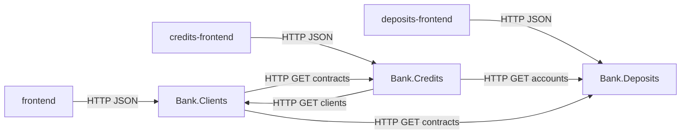

# Лабораторная работа № 3

**Дисциплина:** методы и технологии проектирования сложных систем (MTPSA)  
**Тема:** информационная система банка, модуль «Кредитные операции с физическими лицами»  
**Вариант:** ЗАО «Альфа-Банк» (Республика Беларусь)  
**Исполнитель:** Глушаченко Никита Сергеевич  
**Репозиторий:** _ссылка будет добавлена_

## 1. Цель работы

Реализовать модуль кредитных операций с физическими лицами: справочник плана счетов, заключение кредитного договора, открытие лицевых счетов, график платежей, двойную запись по учебной схеме, процедуру «Закрытие банковского дня», оборотную ведомость с учётом депозитных счетов из лабораторной работы № 2, связь с модулем «Клиенты», REST API, web-клиент и набор автотестов: модульных, интеграционных и функциональных.

## 2. Постановка задачи

По заданию лабораторной работы необходимо:

1. Для банка варианта выбрать два кредитных продукта для физических лиц:
   - кредит с ежемесячным погашением долга аннуитетным платежом;
   - кредит с ежемесячным погашением процентов и выплатой полной суммы кредита в конце срока.
2. Разработать справочник «План счетов» и внести в него счета, необходимые для обслуживания выбранных кредитных линий.
3. Разработать форму заключения кредитного договора с контролем корректности вводимых данных.
4. Связать данные о физическом лице с модулем «Клиенты». При заключении договора создавать не менее двух счетов (основная сумма и обслуживание процентов) с 13-значной нумерацией.
5. Использовать счёт фонда развития банка (СФРБ) из предыдущей работы: с него выделяются средства при кредитовании, на него зачисляются поступления по депозитам.
6. Сформировать график начисления процентов (аннуитет с разбивкой по срокам и второй график).
7. Реализовать процедуру «Закрытие банковского дня» и отчёт по счетам: при двух активных кредитных программах — не менее десяти счетов с учётом депозитных из лабораторной работы № 2.

Стек задания (Java + Spring + H2) заменён на **C# / ASP.NET Core + React + in-memory SQLite**, как в лабораторных работах № 1 и № 2. Функциональные требования сохранены.

### 2.1. Вариант: Альфа-Банк (Беларусь)

Выбраны розничные продукты банка ([каталог кредитов](https://www.alfabank.by/credits/), [кредит наличными](https://www.alfabank.by/credits/cash/), [кредит онлайн](https://www.alfabank.by/credits/online/credit/), сверка 21.09.2026):

| Требование задания | Продукт банка | Балансовый счёт | Ставка | Срок | Сумма | Погашение в системе |
| --- | --- | --- | --- | --- | --- | --- |
| Аннуитет | [Кредит наличными](https://www.alfabank.by/credits/cash/) | 2410 | 18,1% | 12 мес. | 1 000–20 000 BYN | равные платежи |
| Проценты ежемесячно, тело в конце срока | [Кредит онлайн](https://www.alfabank.by/credits/online/credit/) | 2420 | 18,1% | 24 мес. | 500–7 000 BYN | проценты каждый месяц, тело в дату окончания |

Отступления от публичного тарифа, принятые для соответствия тексту задания:

- у банка оба продукта погашаются равными платежами; для второй линии по заданию смоделирована схема «проценты ежемесячно + полная сумма кредита в конце срока»;
- из линейки «наличными» зафиксирован срок 12 месяцев (есть также 24 и 36);
- стартовый капитал СФРБ совпадает с лабораторной работой № 2: 1 000 000 BYN (учебная сумма после деноминации вместо «100 млрд» в формулировке задания).

## 3. Архитектура решения

Приложение состоит из семи частей:

- `Bank.Common` — общие DTO, типы ошибок, локаль, разбор дат, HTTP-результат и Aspire service defaults;
- `Bank.Clients` — API лабораторной работы № 1;
- `Bank.Deposits` — API лабораторной работы № 2;
- `Bank.Credits` — API лабораторной работы № 3 (договоры, график, проводки, банковский день);
- `frontend` / `deposits-frontend` / `credits-frontend` — отдельные React (Vite) приложения;
- `Bank.AppHost` — .NET Aspire, три API и три Vite.

Сервисы не ссылаются друг на друга проектно. Клиенты и договоры связываются по `clientId` через HTTP:

- `Bank.Credits` запрашивает `GET /api/clients` и `GET /api/clients/{id}`;
- `Bank.Credits` запрашивает `GET /api/accounts` у депозитов, чтобы включить депозитные счета в отчёт;
- `Bank.Clients` при удалении вызывает `GET /api/deposits/contracts?clientId=` и `GET /api/credits/contracts?clientId=`.

Каждый API держит свою in-memory SQLite (`Mode=Memory;Cache=Shared`). При старте выполняется `Migrate()`. Сервис кредитов заполняет план счетов, валюты, продукты, кассу, корсчёт, СФРБ и создаёт два демонстрационных договора, если сервис клиентов уже отвечает.



Обработка запроса совпадает с предыдущими работами: endpoint → Mediator → handler (Command/Query) → DTO. Сущности БД наружу не отдаются. Тексты ошибок API — ключи i18n.

## 4. Реализация

### 4.1. Модель данных

Таблицы модуля кредитов: `ChartAccounts`, `Currencies`, `CreditProducts`, `BankAccounts`, `CreditContracts`, `LedgerEntries`, `BankStates`.

План счетов (учебный план НБРБ):

| Код | Наименование | А/П |
| --- | --- | --- |
| 1010 | Касса банка | А |
| 1201 | Корреспондентский счёт в НБ РБ | А |
| 2410 | Краткосрочные кредиты физическим лицам | А |
| 2420 | Долгосрочные кредиты физическим лицам | А |
| 2471 | Начисленные проценты по краткосрочным кредитам | А |
| 2472 | Начисленные проценты по долгосрочным кредитам | А |
| 7327 | Фонд развития банка | П |

Номер лицевого счёта — 13 цифр, как в лабораторной работе № 2: `AAAA` + `CCCCC` + `SSS` + ключ по весам `7, 1, 3`.

При заключении договора создаются два счёта: тело кредита (2410 или 2420) и процентный (2471 или 2472). Наименование — ФИО клиента.

Стартовый капитал СФРБ: Дт 1201 / Кт 7327 на сумму 1 000 000 BYN. Демонстрационные договоры: «Кредит наличными» (клиент 4, 3 000 BYN) и «Кредит онлайн» (клиент 5, 2 000 BYN) на банковскую дату 20.09.2026. Удаление клиента, у которого есть кредитный договор, отклоняется (`clientHasCredits`).

### 4.2. Бухгалтерские проводки

Двойная запись (актив: дебет увеличивает, кредит уменьшает; пассив — наоборот). Кредитная выдача — обратная к депозитному открытию: средства СФРБ используются, касса выдаёт наличные клиенту.

| Операция | Дебет | Кредит |
| --- | --- | --- |
| Выделение кредита | 7327 | ссудный счёт |
| Выдача через кассу | ссудный счёт | 1010 |
| Начисление процентов | процентный счёт | 7327 |
| Внесение процентов в кассу | 1010 | процентный счёт |
| Погашение тела из кассы | 1010 | ссудный счёт |
| Возврат тела в СФРБ | ссудный счёт | 7327 |

Ссудный и процентный счета работают как транзитные: после пары проводок их сальдо снова 0, долг хранится в `RemainingPrincipal` договора.

### 4.3. График платежей и закрытие дня

Аннуитет: платёж `P × r × (1+r)^n / ((1+r)^n − 1)`, `r = ставка / 12`, последний период забирает остаток.  
Вторая линия: каждый месяц только проценты `P × r`, в последнем периоде — проценты и всё тело.

Даты платежей: `дата начала + k месяцев`. «Закрытие банковского дня» сдвигает операционную дату на сутки и проводит платёж, если дата совпала с графиком.

### 4.4. REST API

| Метод | URL | Назначение |
| --- | --- | --- |
| `GET` | `/api/credits/dictionaries` | Продукты, валюты, клиенты |
| `GET` | `/api/credits/contracts` | Список договоров |
| `GET` | `/api/credits/contracts/{id}` | Карточка и график |
| `POST` | `/api/credits/contracts` | Заключение договора |
| `GET` | `/api/accounts` | Оборотная ведомость (свои счета + депозитные по HTTP) |
| `GET` | `/api/banking-day` | Текущая банковская дата |
| `POST` | `/api/banking-day/close` | Закрытие банковского дня |

### 4.5. Web-клиент

Модуль «Клиенты» (`frontend`): на `/` рядом с депозитами добавлена кнопка «Перейти к кредитам».

Модуль «Кредиты» (`credits-frontend`):

- `/` — список договоров, банковская дата, закрытие дня;
- `/contracts/new` — форма договора и предпросмотр графика;
- `/contracts/:id` — полный график;
- `/accounts` — оборотная ведомость.

Поля формы: клиент, вид кредита, номер, валюта, даты, срок, сумма, ставка. При выборе продукта подставляются срок, ставка, валюта и дата окончания.

### 4.6. Валидация

Сервер: FluentValidation + сверка со справочниками и банковской датой (`CreditWriteValidator`).  
Клиент: `credits-frontend/src/validation.ts`. Правила те же, что у депозитов: клиент и продукт существуют, валюта BYN, сумма в диапазоне, срок и ставка совпадают с продуктом, дата окончания = начало + срок, дата начала не раньше банковского дня, номер уникален (пустой генерируется как `К-ГГГГ-NNNN`).

## 5. Тестирование

Тесты — MSTest, проект `Test.Credits`. Три уровня:

| Уровень | Что проверяет | Как |
| --- | --- | --- |
| Unit | ключ счёта, аннуитет и «проценты + тело», закрытие дня, валидатор | in-memory SQLite без HTTP |
| Integration | REST: создание договора, отчёт ≥ 10 счетов, СФРБ, закрытие дня, 400, запрет удаления клиента | реальный Kestrel + HTTP |
| Functional | кнопка перехода, форма, график, список, отчёт, закрытие дня | Selenium WebDriver, headless Chrome, собранный SPA |

Запуск:

```bash
dotnet test Test.Clients/Test.Clients.csproj
dotnet test Test.Deposits/Test.Deposits.csproj
dotnet test Test.Credits/Test.Credits.csproj
```

Для functional-тестов требуется Chrome.

## 6. Запуск приложения

```bash
dotnet run --project Bank.AppHost
```

Aspire поднимает `Bank.Clients`, `Bank.Deposits`, `Bank.Credits` и три Vite. Либо отдельно каждый API и `npm run dev` в `frontend`, `deposits-frontend`, `credits-frontend`.

## 7. Выводы

Реализован модуль кредитных операций с физическими лицами для варианта Альфа-Банк: два продукта, план счетов, 13-значные лицевые счета, график платежей, двойная запись, СФРБ, закрытие банковского дня и оборотная ведомость не менее чем из десяти счетов при двух активных кредитных и двух депозитных программах. Договор связан с модулем «Клиенты» только HTTP. Валидация дублируется на клиенте и сервере. Пользовательский интерфейс кредитов вынесен в отдельное Vite-приложение.

## Приложение А. Контрольный лист проверки

### Пользовательский интерфейс

- [ ] На `/` рядом с «Перейти к депозитам» есть «Перейти к кредитам».
- [ ] Кнопка открывает отдельный фронтенд (`credits-frontend`).
- [ ] Форма договора содержит клиента, вид кредита, номер, валюту, даты, срок, сумму, ставку и график.
- [ ] Доступны список договоров, отчёт по счетам и закрытие банковского дня.

### Параметры продуктов

- [ ] Кредит наличными: 18,1%, 12 мес., минимум 1 000 BYN, максимум 20 000 BYN, аннуитет.
- [ ] Кредит онлайн: 18,1%, 24 мес., минимум 500 BYN, максимум 7 000 BYN, проценты ежемесячно, тело в конце.
- [ ] Сумма вне диапазона отклоняется формой и API.

### Бухгалтерский учёт

- [ ] Новый договор создаёт два счёта из 13 цифр; наименование — ФИО.
- [ ] СФРБ имеет стартовый капитал 1 000 000 BYN; выдача кредита уменьшает фонд и кассу.
- [ ] При двух активных кредитных программах в отчёте не менее десяти счетов (с депозитными).
- [ ] Закрытие дня: аннуитет — ежемесячный платёж тела и процентов; вторая линия — проценты ежемесячно, тело в дату окончания.

### Автотесты

- [ ] `dotnet test Test.Credits/Test.Credits.csproj` завершается без ошибок.
