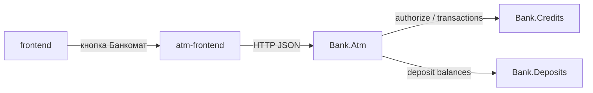

# Лабораторная работа № 4

**Дисциплина:** методы и технологии проектирования сложных систем (MTPSA)  
**Тема:** информационная система банка, модуль «Эмулятор банкомата»  
**Вариант:** ЗАО «Альфа-Банк» (Республика Беларусь)  
**Исполнитель:** Глушаченко Никита Сергеевич  
**Репозиторий:** _ссылка будет добавлена_

## 1. Цель работы

Реализовать эмулятор банкомата, который работает с виртуальным банком предыдущих лабораторных: идентификация карты, проверка PIN на стороне банка, операции по кредитному счёту из лабораторной работы № 3, просмотр остатка депозитного счёта из лабораторной работы № 2, платежи операторам мобильной связи, печать чеков, REST API, отдельный web-клиент и автотесты трёх уровней.

## 2. Постановка задачи

По заданию необходимо программно эмулировать банкомат, который удалённо выполняет:

- аутентификацию держателя счёта (номер карты с клавиатуры и PIN);
- просмотр состояния кредитного счёта;
- снятие денег с кредитного счёта;
- просмотр остатка депозитного счёта;
- оплату телекоммуникационных услуг;
- выдачу чека: для платежа — всегда, для остальных операций — по желанию клиента.

Банкомат связывается с банком для проводок. Модель общения построена на транзакциях: устройство накапливает ввод во внутреннем списке и при готовности отправляет серверу полное описание операции, после чего список очищается. Номер карты запоминается (имитация оставленной в устройстве карты). Три неверных PIN подряд принудительно завершают работу.

Рабочий счёт — кредитный карт-счёт, открываемый к договору из лабораторной работы № 3. Стек, как в работах № 1–3: **C# / ASP.NET Core + React + in-memory SQLite**.

Демонстрационные карты:

| Карта | PIN | Клиент | Кредитный карт-счёт | Депозит |
| --- | --- | --- | --- | --- |
| 4277 0000 1111 2222 | 1111 | 4 | 1 500 BYN | Альфа Сейф, 1 200 BYN |
| 4277 0000 3333 4444 | 2222 | 5 | 1 500 BYN | нет |

## 3. Архитектура решения

Приложение состоит из девяти частей:

- `Bank.Common` — общие DTO, в том числе протокол банкомата, каталог операторов, маска номера карты;
- `Bank.Clients` / `Bank.Deposits` / `Bank.Credits` — API лабораторных работ № 1–3;
- `Bank.Atm` — API эмулятора банкомата (своя БД сессий и чеков);
- `frontend` / `deposits-frontend` / `credits-frontend` / `atm-frontend` — отдельные React (Vite) приложения;
- `Bank.AppHost` — .NET Aspire.

Сервисы не ссылаются друг на друга проектно. `Bank.Atm` вызывает только HTTP:

- `POST /api/credits/atm/authorize` и `POST /api/credits/atm/transactions` — PIN, снятие, кредитный остаток, платёж и проводки;
- `GET /api/deposits/atm/balances?clientId=` — остатки депозитных договоров клиента.

Каждый API держит свою in-memory SQLite (`Mode=Memory;Cache=Shared`). При старте выполняется `Migrate()`.



На устройстве: endpoint → Mediator → обработчик сессии → внутренний список полей → HTTP к банку. Сущности БД наружу не отдаются. Тексты ошибок — ключи i18n.

## 4. Реализация

### 4.1. Протокол банка и банкомата

Внутренний список сессии хранит пары `key/value`: `cardNumber`, `pin`, `operation`, `amount`, `operatorCode`, `phone`. После накопления данных список целиком уходит в банк. PIN проверяет сервер кредитов. После операции список очищается, номер карты и PIN остаются в сессии, как повторное считывание карты в реальном банкомате.

Экраны устройства: ввод карты → PIN → меню → сумма / оператор / телефон / подтверждение → выбор чека → результат.

### 4.2. Учёт на стороне банка

К кредитному договору выпускается карта и пассивный карт-счёт 3014. На него зачисляется до 1 500 BYN (Дт 1010 / Кт 3014) — средства кредита, оставленные на карте. Снятие: Дт 3014 / Кт 1010. Платёж оператору: Дт 3014 / Кт 3819. Остаток депозита не проводится повторно: банкомат читает сумму активного депозитного договора клиента по HTTP.

### 4.3. REST API банкомата

| Метод | URL | Назначение |
| --- | --- | --- |
| `POST` | `/api/atm/sessions` | Вставить карту (начать сессию) |
| `GET` | `/api/atm/sessions/{id}` | Состояние экрана и внутреннего списка |
| `POST` | `/api/atm/sessions/{id}/input` | PIN, пункт меню, сумма, оператор, телефон, чек, возврат карты |

Банк:

| Метод | URL | Назначение |
| --- | --- | --- |
| `POST` | `/api/credits/atm/authorize` | Проверка PIN |
| `POST` | `/api/credits/atm/transactions` | Снятие, кредитный остаток, платёж |
| `GET` | `/api/deposits/atm/balances` | Депозитные остатки клиента |

### 4.4. Web-клиент

На `/` модуля «Клиенты» добавлена кнопка «Перейти к банкомату». `atm-frontend` рисует корпус устройства: экран, цифровые клавиши 0–9, меню операций, чек. Демо-карта подставляется отдельной кнопкой.

## 5. Тестирование

Тесты — MSTest, проект `Test.Atm`. Три уровня:

| Уровень | Что проверяет | Как |
| --- | --- | --- |
| Unit | целая сумма, накопление списка, три попытки PIN | без HTTP |
| Integration | сессия, блокировка карты, снятие, отказ по остатку, депозит, платёж с чеком; банк принимает демо-карту | Kestrel + HTTP, фейковые/реальные API |
| Functional | снятие с чеком, остатки кредита и депозита, платёж A1 | Selenium, headless Chrome, собранный SPA |

Запуск:

```bash
dotnet test Test.Clients/Test.Clients.csproj
dotnet test Test.Deposits/Test.Deposits.csproj
dotnet test Test.Credits/Test.Credits.csproj
dotnet test Test.Atm/Test.Atm.csproj
```

Для functional-тестов требуется Chrome.

## 6. Запуск приложения

```bash
dotnet run --project Bank.AppHost
```

Aspire поднимает четыре API и четыре Vite. Либо отдельно каждый API и `npm run dev` в соответствующих каталогах фронтенда.

## 7. Выводы

Реализован эмулятор банкомата для варианта Альфа-Банк: идентификация карты, проверка PIN банком, внутренний список транзакции, снятие и остаток кредитного карт-счёта, остаток депозита, оплата мобильной связи с автоматическим чеком, отдельные БД и HTTP-связь без проектных ссылок между сервисами. Пользовательский интерфейс вынесен в отдельное Vite-приложение и открывается кнопкой с главной страницы.

## Приложение А. Контрольный лист проверки

### Пользовательский интерфейс

- [ ] На `/` есть кнопка «Перейти к банкомату».
- [ ] Кнопка открывает отдельный фронтенд (`atm-frontend`).
- [ ] Ввод номера карты и PIN с клавиатуры эмулятора; три неверных PIN блокируют сессию.
- [ ] Меню: снятие, кредитный остаток, депозитный остаток, платёж, возврат карты.
- [ ] Платёж: оператор → телефон 10 цифр → сумма → подтверждение; чек печатается автоматически.
- [ ] Снятие и запрос остатка предлагают чек.

### Банк

- [ ] Демо-карта 4277000011112222 / 1111 связана с кредитным договором клиента 4.
- [ ] Снятие уменьшает остаток карт-счёта 3014 и отражается в кассе.
- [ ] Недостаточный остаток отклоняется.
- [ ] Депозитный остаток клиента 4 равен 1 200 BYN.

### Автотесты

- [ ] `dotnet test Test.Atm/Test.Atm.csproj` завершается без ошибок.
